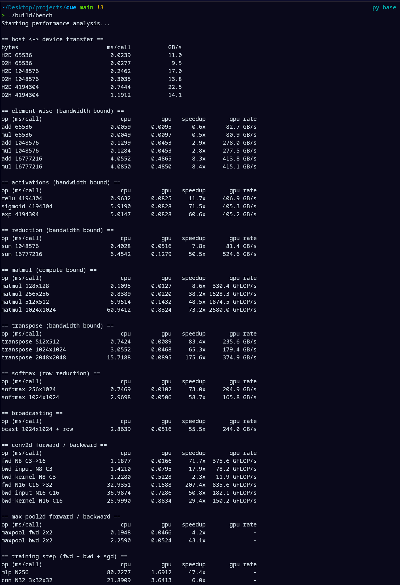

# cue

Cue is a small ML library written in CUDA C++.

Cue supports:

- Tensor operations and broadcasting
- Loading data from tensors and .csv files, deploying it on a GPU/CPU device
- Loading data with a DataLoader class, batching and normalizing data
- Backpropagation, stochastic gradient descent, convolutional layers, max pooling layers, sequential & linear layers
- Cross entropy loss, mean squared error, and ReLU

To demo cue's abilities, you can test train a convolutional network ran on the Iris dataset and watch its loss decrease in real time. Cue also comes with a built-in testing suite (test/) and a benchmarking suite (bench/).

### Running cue

Build the library and tests:

```sh
cmake -S . -B build
cmake --build build -j
```

Run all tests:

```sh
ctest --test-dir build --output-on-failure
```

Run an individual test executable:

```sh
./build/test_tensor
./build/test_nn
./build/test_data
./build/test_train_iris
```

## Performance benchmarking instructions (CPU vs GPU)

Build it (it is built as part of the normal `cmake --build` above) and run the
whole suite:

```sh
./build/bench
```

Run only some groups by passing one or more filter terms (matched as
substrings against the group name), or list the available groups:

```sh
./build/bench list                # print the group names
./build/bench matmul conv         # only the matmul and conv groups
./build/bench elementwise         # only the element-wise group
./build/bench all                 # run everything
```

The available groups are: `transfer`, `elementwise`, `activation`,
`reduction`, `matmul`, `transpose`, `softmax`, `broadcast`, `conv`, `pool`,
`train`.

### Example Output

```
== matmul (compute bound) ==
op (ms/call)                       cpu         gpu   speedup       gpu rate
matmul 512x512                  7.0718      0.1429     49.5x 1879.1 GFLOP/s
matmul 1024x1024               63.4944      0.8357     76.0x 2569.7 GFLOP/s
```

Screenshot of performance benchmarking output on a NVIDIA RTX 5070 Ti:


## Performance analysis

We see a notable (but small) increase in GPU processing time for the add and mul kernels when they work on small inputs as a result of the GPU kernel overhead. As input size increases, the GPU speedup jumps to 8.4x.

We see large speedups in the GPU kernels for the activation functions, matrix multiplication, transposition, broadcasting, convolutional layers, max pooling layers, and neural network training, as expected. Interestingly, the largest GPU speedup comes in the forward pass of the convolutional layer, the CPU struggles with this significantly due to the high volume of matrix multiplication.

Overall, the performance increase for the GPU kernels is significant compared to the CPU version, especially in regards to training neural network models.

## Potential improvements

- Small kernels are dominated by launch latency, so some kernels ran on small inputs actually have less performance than
  if the same operations were ran on the CPU. Implementing some kind of persistent reusable scratch buffer or CUDA streams
  would fix this.
- Storage and kernels are float only, which can dull performance in areas where high accuracy is not necessary. Implementing
  half / mixed precision or even the ability to quantize a model would be a great improvement and save performance on tasks that can handle low accuracy.
- Some kernels like 'sum_to_channel' and 'sum_axis0' would benefit from warp-shuffle block reduction
- Several neural network layers run as separate kernels, so combining kernels would remove extra passes over global memory and increase performance
